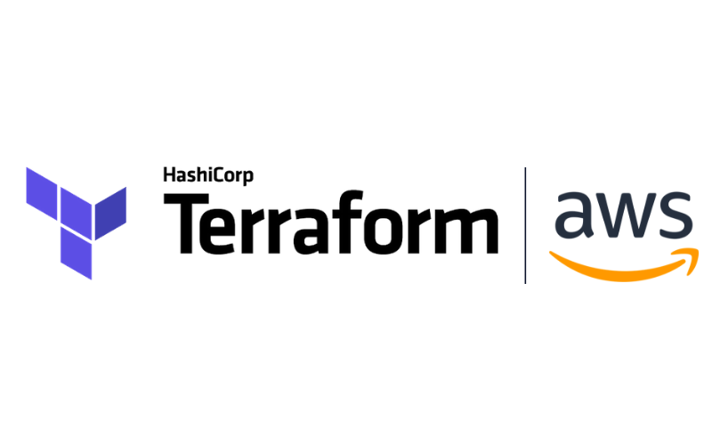

# Terraform Cloud Getting Started Guide Example

This is an example Terraform configuration intended for use with the [Terraform Cloud Getting Started Guide](https://learn.hashicorp.com/terraform/cloud-gettingstarted/tfc_overview).

## What will this do?

This is a simple Terraform configuration that will create an empty [EC2](https://aws.amazon.com/free/?all-free-tier.sort-by=item.additionalFields.SortRank&all-free-tier.sort-order=asc) instance using your AWS account.

After setting up a Workspace on Terraform Cloud, use this repository. Terraform Cloud can then run `terraform plan` and `terraform apply` automatically when changes are pushed.

## What are the prerequisites?

You must have an AWS account and provide your AWS Access Key ID and AWS Secret Access Key to Terraform Cloud.

The values for `AWS_ACCESS_KEY_ID` and `AWS_SECRET_ACCESS_KEY` should be saved as environment variables on your workspace.

